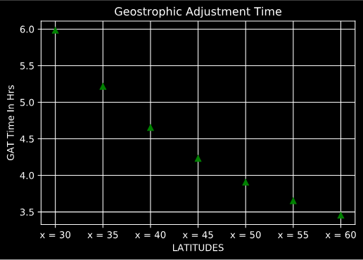
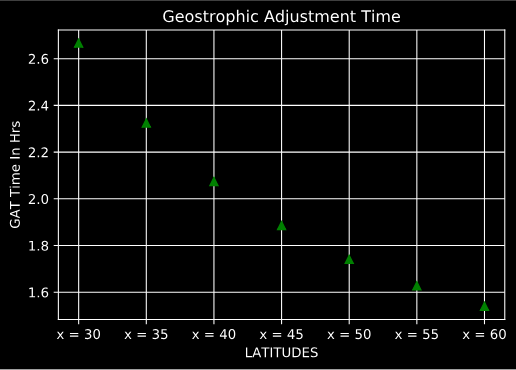
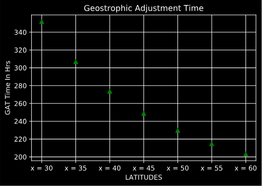

# Anayeli Ochoa 
## MTR 3400 Assignment #3
## GitHub: github.com/Irlanda3

                           Coriolis parameter
$$ f = 2Ωsin(Φ)$$
                    geostrophic adjustment time
$$geostrophic     adjustment     time= 1/4(2π / f)  $$

# Part 1

Earth angular velocity:  0.004178079012116429
f_coriolis parameter:  15.041084443619141
Geostrophic Adjustment Time 30° :  5.983611111111113 hrs

Earth angular velocity:  0.004178079012116429
f_coriolis parameter:  17.254423228052453
Geostrophic Adjustment Time 35° :  5.216053808954732 hrs

Earth angular velocity:  0.004178079012116429
f_coriolis parameter:  19.336445433214678
Geostrophic Adjustment Time 40° :  4.654423188111132 hrs

Earth angular velocity:  0.004178079012116429
f_coriolis parameter:  21.271305612965172
Geostrophic Adjustment Time 45° :  4.2310519926498396 hrs

Earth angular velocity:  0.004178079012116429
f_coriolis parameter:  23.044278313035502
Geostrophic Adjustment Time 50° :  3.90552478048703 hrs

Earth angular velocity:  0.004178079012116429
f_coriolis parameter:  24.641870140627947
Geostrophic Adjustment Time 55° :  3.6523201967375734 hrs

Earth angular velocity:  0.004178079012116429
f_coriolis parameter:  26.051922457282213
Geostrophic Adjustment Time 60° :  3.454639485726036 hrs

# Part 2
## Saturn almost have 1/2 the hours of an earth day

Saturn angular velocity in degrees:  0.009375
f_coriolis parameter:  33.74999999999999
Geostrophic Adjustment Time 30° :  2.6666666666666674 hrs

Saturn angular velocity in degrees:  0.009375
f_coriolis parameter:  38.716409453695604
Geostrophic Adjustment Time 35° :  2.3245957274947977 hrs

Saturn angular velocity in degrees:  0.009375
f_coriolis parameter:  43.3881636538414
Geostrophic Adjustment Time 40° :  2.074298435813883 hrs

Saturn angular velocity in degrees:  0.009375
f_coriolis parameter:  47.72970773009196
Geostrophic Adjustment Time 45° :  1.8856180831641267 hrs

Saturn angular velocity in degrees:  0.009375
f_coriolis parameter:  51.707999910531015
Geostrophic Adjustment Time 50° :  1.7405430524430383 hrs

Saturn angular velocity in degrees:  0.009375
f_coriolis parameter:  55.29276298950694
Geostrophic Adjustment Time 55° :  1.6276994516819416 hrs

Saturn angular velocity in degrees:  0.009375
f_coriolis parameter:  58.4567147554496
Geostrophic Adjustment Time 60°:  1.539600717839002

# Part 3

## Mercury has 1,408 hours which is more that 2 times the hrs of an Earth day

Mercury angular velocity in degrees:  7.104753672269554e-05
f_coriolis parameter:  0.2557711322017039
Geostrophic Adjustment Time 30°:  351.8770833333334

Mercury angular velocity in degrees:  7.104753672269554e-05
f_coriolis parameter:  0.2934085890594513
Geostrophic Adjustment Time 35°:  306.7394866949991

Mercury angular velocity in degrees:   7.104753672269554e-05
f_coriolis parameter:  0.32881302938950624
Geostrophic Adjustment Time 40°:  273.7117813339068

Mercury angular velocity in degrees:  7.104753672269554e-05
f_coriolis parameter:  0.36171500402317164
Geostrophic Adjustment Time 45°:  248.81467176914384

Mercury angular velocity in degrees:  7.104753672269554e-05
f_coriolis parameter:  0.3918641090667296
Geostrophic Adjustment Time 50°:  229.67145476615752

Mercury angular velocity in degrees:  7.104753672269554e-05
f_coriolis parameter:  0.4190308916262715
Geostrophic Adjustment Time 55°:  214.78130085041533

Mercury angular velocity in degrees:  7.104753672269554e-05
f_coriolis parameter:  0.4430085960827674
Geostrophic Adjustment Time 60°:  203.1563287841604

